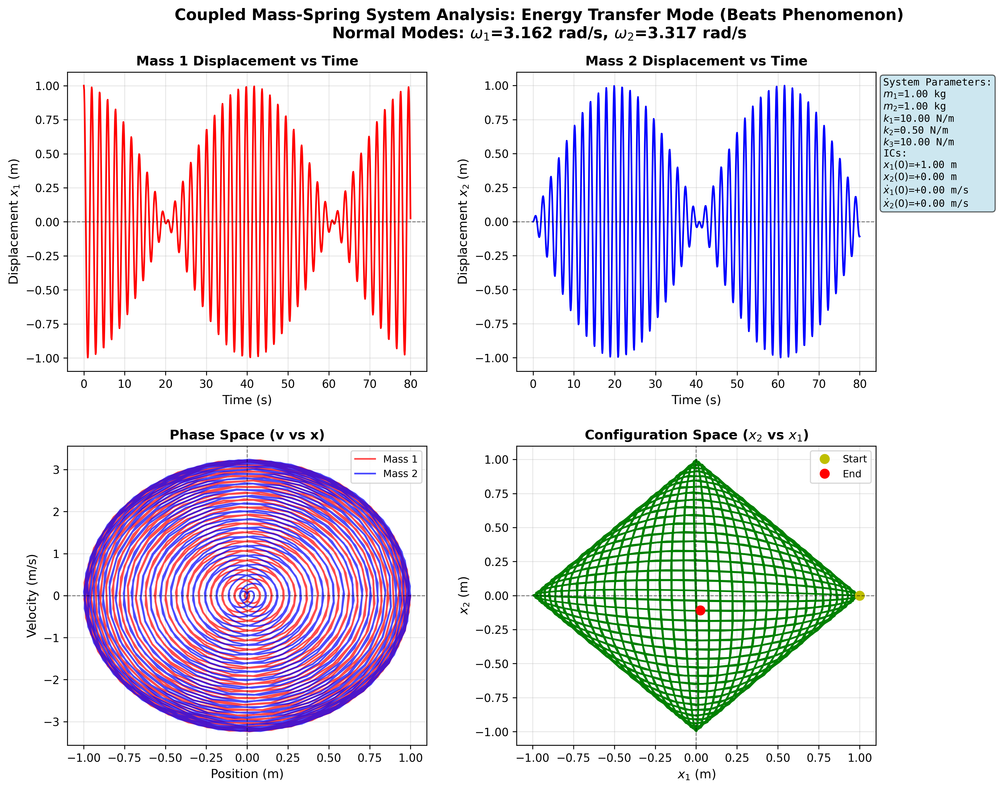
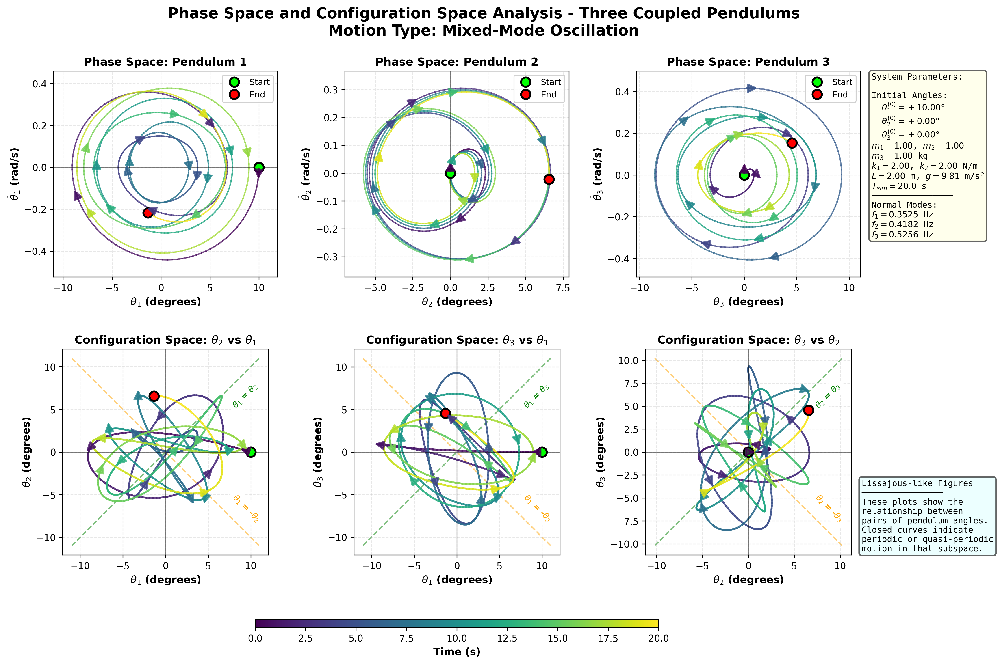
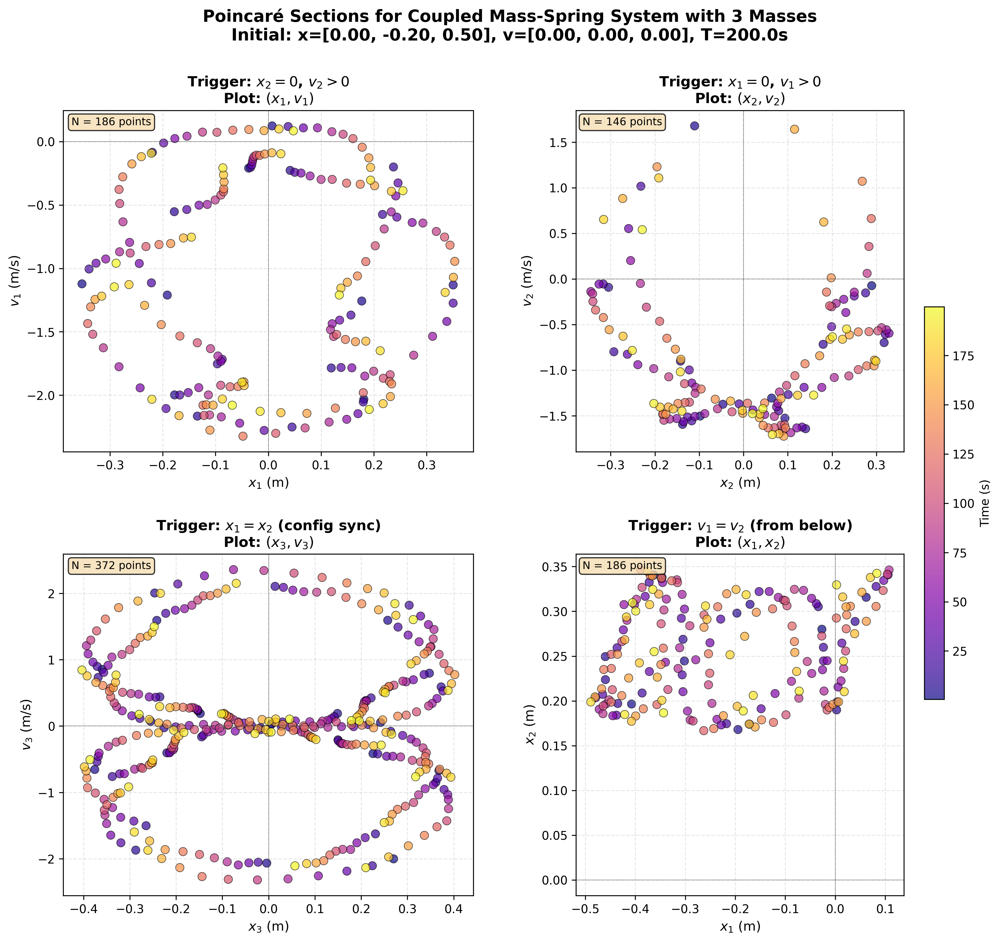
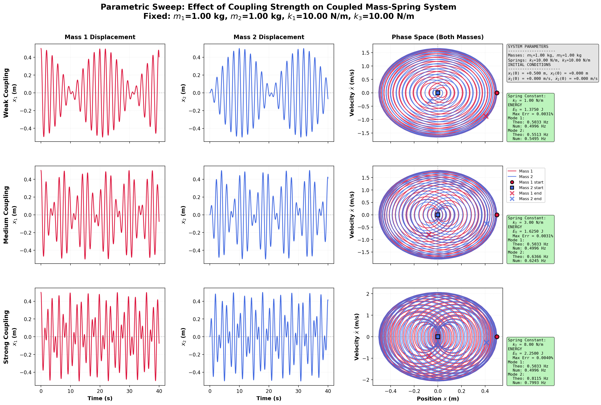

# Coupled Oscillations: Theory, Simulation, and Analysis

> **A comprehensive computational physics notebook exploring coupled oscillator systems through rigorous theory, numerical integration, and multi-domain diagnostics**

[](https://www.python.org/)
[](https://jupyter.org/)
[](https://numpy.org/)
[](https://scipy.org/)
[](https://matplotlib.org/)

---

## 🎬 Demo

| **Three Pendulum System** | **Double Pendulum Beats** |
|:-------------------------:|:-------------------------:|
| 
 |  
|


## 📖 Overview

This repository provides a **theory-first, computation-forward** study of coupled oscillations across two canonical physical systems:

1. **Spring-Coupled Pendulums** — Nonlinear dynamics with spring coupling dependent on horizontal displacement
2. **Coupled Mass–Spring Chains** — Finite chains with matrix/eigenmode structure and normal-mode decomposition

The project bridges classical mechanics theory with modern computational physics, combining:
- **Lagrangian derivations** for exact equations of motion
- **Numerical ODE integration** using scipy's `solve_ivp`
- **Normal mode analysis** via eigenvalue decomposition
- **Frequency-domain diagnostics** (FFT, modal projection, peak detection)
- **Interactive animations** and phase-space visualizations

---

## ✨ Key Features

### 🎯 **Comprehensive Coverage**
- **Two & Three Spring-Coupled Pendulums**: Exact nonlinear equations + small-angle linearization
- **Two-Mass Three-Spring System**: Wall-bounded oscillators with explicit coupling
- **N-Mass Chains**: Generalized framework for arbitrary finite chains with tridiagonal stiffness matrices

### 🧮 **Rigorous Mathematics**
- Full Lagrangian derivations (kinetic + potential energy → Euler–Lagrange equations)
- Exact nonlinear ODEs (no approximations during integration)
- Linearized small-angle theory for analytical normal-mode predictions
- Generalized eigenvalue problems: $K\mathbf{v} = \omega^2 M\mathbf{v}$

### 💻 **Robust Numerics**
- Clean, reusable state-space derivative functions
- High-order integration with `solve_ivp` (RK45 adaptive method)
- Modal projection + FFT for frequency extraction from simulated data
- Hann windowing to reduce spectral leakage

### 📊 **Multi-Domain Diagnostics**
- **Time Series**: Angular/displacement evolution with energy tracking
- **Phase Portraits**: $(\theta, \dot\theta)$ and $(x, \dot x)$ trajectories
- **Configuration Space**: Multi-dimensional coordinate plots
- **Frequency Analysis**: FFT spectra with theoretical mode overlays and peak annotations
- **Poincaré Sections**: Stroboscopic sampling for quasi-periodic motion

### 🎬 **Interactive Visualizations**
- Real-time animations synchronized with physics simulations
- Dynamic spring rendering (compression/extension with realistic coils)
- Exportable animations (GIF/MP4 formats)


## 📂 Repository Structure

```
📦 Coupled-Oscillations-Physics-Notebook
├── 📓 coupled_oscillations.ipynb  # Main Jupyter notebook (11,000+ lines)
├── 📄 README.md                   # This file
├── 📋 requirements.txt            # Python dependencies
├── 📝 theory.md                   # Extended theoretical derivations (if present)
├── 🎞️ OUTPUTS/                    # Output directory
│   ├── ANIMATIONS/                # Saved animation files
│   └── FIGURES/                   # Static plots and diagrams
```

---

## 🚀 Getting Started

### Prerequisites

- Python 3.8 or higher
- Jupyter Notebook or JupyterLab
- Required packages (see below)

### Installation

1. **Clone the repository**
   ```bash
   git clone https://github.com/yourusername/coupled-oscillations-physics.git
   cd coupled-oscillations-physics
   ```

2. **Install dependencies**
   ```bash
   pip install -r requirements.txt
   ```

   Or manually install core packages:
   ```bash
   pip install numpy scipy matplotlib jupyter ipympl
   ```

3. **Launch Jupyter Notebook**
   ```bash
   jupyter notebook coupled_oscillations.ipynb
   ```
   
   For JupyterLab (recommended for interactive widgets):
   ```bash
   jupyter lab coupled_oscillations.ipynb
   ```

### Quick Start

Open `notebook.ipynb` and execute cells sequentially. The notebook is organized into self-contained sections:

- **Section 1**: Two spring-coupled pendulums (nonlinear model)
- **Section 2**: Three spring-coupled pendulums
- **Section 3**: Two coupled mass–spring oscillators
- **Section 4**: N-mass N-spring chains with arbitrary configurations

Each section includes:
1. Geometry visualization
2. Theoretical derivations (displayed as LaTeX)
3. Numerical integration functions
4. Animation generation
5. Diagnostic plots (time series, FFT, phase space)

---

## 📚 Physics Background
### Coupled Pendulums

Consider two pendulums of length $L$ with masses $m_1, m_2$ connected by a horizontal spring (stiffness $k$). The spring coupling depends on the horizontal separation:

$$
\Delta x = L(\sin\theta_2 - \sin\theta_1)
$$

**Exact Nonlinear Equations** (no small-angle approximation):
$$
\begin{aligned}
\ddot\theta_1 &= -\frac{g}{L}\sin\theta_1 + \frac{k}{m_1}(\sin\theta_2 - \sin\theta_1)\cos\theta_1 \\
\ddot\theta_2 &= -\frac{g}{L}\sin\theta_2 - \frac{k}{m_2}(\sin\theta_2 - \sin\theta_1)\cos\theta_2
\end{aligned}
$$

**Linearized Normal Modes** (small angles: $\sin\theta \approx \theta$, $\cos\theta \approx 1$):
- In-phase mode: $\omega_1^2 = g/L$
- Out-of-phase mode: $\omega_2^2 = g/L + k(1/m_1 + 1/m_2)$

### Mass–Spring Chains

For $N$ masses with $(N+1)$ springs, the matrix equation is:
$$
M\ddot{\mathbf{x}} + K\mathbf{x} = 0
$$

where $M = \text{diag}(m_1, \ldots, m_N)$ and $K$ is the tridiagonal stiffness matrix:
$$
K_{jj} = k_j + k_{j+1}, \quad K_{j,j-1} = -k_j, \quad K_{j,j+1} = -k_{j+1}
$$

Normal modes satisfy the generalized eigenvalue problem:
$$
K\mathbf{a} = \omega^2 M\mathbf{a}
$$

---

## 🎓 Educational Use Cases

This notebook is ideal for:

- **Classical Mechanics Courses**: Supplement lectures on oscillations, normal modes, and Lagrangian mechanics
- **Computational Physics Labs**: Hands-on experience with ODE integration, eigenvalue problems, and FFT analysis
- **Research**: Template for studying more complex coupled systems (e.g., nonlinear resonances, chaos)
- **Self-Study**: Learn advanced physics through interactive coding and visualization

---

## 🛠️ Technical Details

### Numerical Methods

- **ODE Solver**: `scipy.integrate.solve_ivp` with RK45 (Runge-Kutta 4th/5th order adaptive)
- **Eigenvalue Solver**: `scipy.linalg.eigh` for symmetric generalized problems
- **FFT**: `numpy.fft.rfft` for real-valued signals (optimized Fourier transform)
- **Peak Detection**: `scipy.signal.find_peaks` with prominence/height filtering

### Animation System

- **Framework**: Matplotlib's `FuncAnimation`
- **Rendering**: Real-time spring coil generation with parametric curves
- **Export**: Pillow (GIF) and FFmpeg (MP4) backends
- **Interactive Mode**: `%matplotlib ipympl` for in-notebook widgets

### Performance Considerations

- Dense output evaluation for smooth animations (uniform time grid)
- Vectorized NumPy operations for coordinate transformations
- Precomputed geometry (spring hooks, equilibrium positions)
- Efficient modal projection via matrix multiplication

---

## 📊 Sample Output

### Animation Examples

#### Two Coupled Pendulums — Energy transfer through beats phenomenon

<div align="center">
  <video width="700" controls>
    <source src="OUTPUTS/ANIMATIONS/coupled_pendulum/double_pendulum/beats_time_series.mp4" type="video/mp4">
    <a href="OUTPUTS/ANIMATIONS/coupled_pendulum/double_pendulum/beats_time_series.mp4">Download the video</a>
  </video>
</div>


#### Three Coupled Pendulums — Complex mode mixing

<div align="center">
  <video width="700" controls>
    <source src="OUTPUTS/ANIMATIONS/coupled_pendulum/three_pendulum/energy_transfer_time_series.mp4" type="video/mp4">
    <a href="OUTPUTS/ANIMATIONS/coupled_pendulum/three_pendulum/energy_transfer_time_series.mp4">Download the video</a>
  </video>
</div>

#### Two Mass System — Beating patterns from mode superposition

<div align="center">
  
</div>

#### N-Mass Chain — Wave-like collective motion

<div align="center">
  
</div>

### Diagnostic Plots

<div align="center">
  <table>
    <tr>
      <td align="center">
        
        <br/>
        <em>FFT Spectrum with Peak Annotations</em>
      </td>
      <td align="center">
        
        <br/>
        <em>Phase Portrait (θ, ω)</em>
      </td>
    </tr>
    <tr>
      <td align="center">
        
        <br/>
        <em>3D Configuration Space Trajectory</em>
      </td>
      <td align="center">
        
        <br/>
        <em>Poincaré Section Analysis</em>
      </td>
    </tr>
  </table>
</div>

**Key Diagnostic Features:**
1. **FFT Spectra**: Dominant peaks annotated with frequencies (Hz) and theoretical predictions
2. **Phase Portraits**: Limit cycles and fixed points in $(\theta, \omega)$ space
3. **Configuration Space**: 3D trajectories in $(x_1, x_2, x_3)$ coordinates
4. **Poincaré Sections**: Cross-sectional slices revealing quasi-periodic structure

---

## 🧩 Customization & Extension

### Modify System Parameters

Edit function calls to explore different regimes:
```python
animation = simulate_double_pendulum(
    theta_1_init=30.0,    # Initial angle (degrees)
    theta_2_init=-30.0,   # Out-of-phase start
    m1=1.0, m2=2.0,       # Unequal masses
    k=50.0,               # Strong coupling
    L=1.5,                # Pendulum length
    g=9.81,               # Earth gravity
    simulation_time=30.0  # Long integration
)
```

<div align="center">
  
  <br/>
  <em>Comparison of different coupling strengths in the mass-spring system</em>
</div>

### Add New Systems

Follow the modular structure:
1. Define geometry function (optional visualization)
2. Implement state-space derivatives
3. Compute theoretical normal modes
4. Create numerical frequency estimator
5. Build animation routine

### Export Data

Save simulation results for external analysis:
```python
# After integration
np.savetxt('trajectory.csv', 
           np.column_stack([t, theta1, theta2]),
           header='time,theta1,theta2',
           delimiter=',')
```

---

## 📜 License

This project is licensed under the MIT License — see the [LICENSE](LICENSE) file for details (or specify your preferred license).

---

## 🙏 Acknowledgments

- **Classical Mechanics**: Goldstein, Taylor & Marion, and Landau & Lifshitz for theoretical foundations
- **Numerical Methods**: SciPy community for robust scientific computing tools
- **Visualization**: Matplotlib developers for publication-quality graphics
- **Inspiration**: Physics educators and researchers advancing computational pedagogy

---

## 📖 References

1. Goldstein, H., Poole, C., & Safko, J. (2002). *Classical Mechanics* (3rd ed.). Addison-Wesley.
2. Taylor, J. R. (2005). *Classical Mechanics*. University Science Books.
3. Strogatz, S. H. (2015). *Nonlinear Dynamics and Chaos* (2nd ed.). CRC Press.
4. Press, W. H., et al. (2007). *Numerical Recipes: The Art of Scientific Computing* (3rd ed.). Cambridge University Press.

---

**Made with ❤️ and Python** | **Bridging Theory and Computation**
